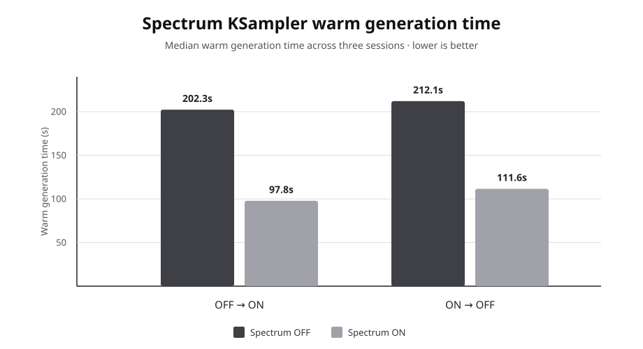

# Spectrum KSampler Ablation on Apple Silicon

[Spectrum](https://github.com/hanjq17/Spectrum) is a training-free diffusion acceleration method that forecasts intermediate denoiser features so selected network evaluations can be skipped. This case study measures its end-to-end effect in a real ComfyUI KSampler workload using Comfy Metal Lab.

This is **not** a reproduction of the paper's benchmark. It is an independent workflow-level ablation on Apple Silicon.

## Setup

- Apple M5 Pro, 64 GB unified memory
- ComfyUI + stock PyTorch MPS execution
- 896 × 1600 image generation, 36 sampling steps
- 3 isolated cold/warm sessions per condition
- Primary metric: median **warm generation time**
- Only Spectrum enable/disable state changed between conditions

The experiment was repeated in both condition orders to check for simple ordering bias:

```text
Run A: Spectrum OFF -> ON
Run B: Spectrum ON  -> OFF
```

Spectrum settings were held fixed when enabled: window 2.0, flex window 0.2, 6 warmup steps, 3 tail actual steps, blend 0.3, Chebyshev degree 3, and ridge lambda 0.1.

## Result



| Execution order | Spectrum OFF | Spectrum ON | Speedup |
| --- | ---: | ---: | ---: |
| OFF -> ON | 202.30 s | 97.82 s | **2.07×** |
| ON -> OFF | 212.10 s | 111.63 s | **1.90×** |

Across the two execution orders, the observed speedup was **1.90×–2.07×** (geometric mean: **1.98×**). In this workload, Spectrum reduced steady-state KSampler generation time by roughly half.

Absolute timing moved between runs, but reversing the condition order did not change the main conclusion. The second condition was not consistently faster, so no strong one-direction ordering bias was observed in this test. This is still a sequential experiment rather than a randomized/interleaved one.

The Spectrum trace reported **19 actual evaluations and 17 cached/forecast steps** per 36-step generation, which is directionally consistent with the measured end-to-end reduction.

## Output similarity

Spectrum changes the execution path, so ON and OFF outputs were not bit-identical. For the same seeds, RGB SSIM was:

- cold: **0.9836**
- warm: **0.9892**

Within the same condition, forward-order and reverse-order outputs were exact hash matches for every tested seed. Timing varied; generated outputs remained deterministic.

## Sources and provenance

Spectrum originates from:

- Jiaqi Han, Juntong Shi, Puheng Li, Haotian Ye, Qiushan Guo, Stefano Ermon, **“Adaptive Spectral Feature Forecasting for Diffusion Sampling Acceleration,” CVPR 2026** — [CVF paper](https://openaccess.thecvf.com/content/CVPR2026/html/Han_Adaptive_Spectral_Feature_Forecasting_for_Diffusion_Sampling_Acceleration_CVPR_2026_paper.html), [official code](https://github.com/hanjq17/Spectrum)

The ComfyUI integration used for this measurement was:

- [`sorryhyun/ComfyUI-Spectrum-KSampler`](https://github.com/sorryhyun/ComfyUI-Spectrum-KSampler), commit `e6a6223`

Timing, memory, and output measurements were taken from Comfy Metal Lab `report.json` session artifacts. Raw local workflows, prompts, generated images, and machine-specific paths are intentionally excluded from the public repository.
